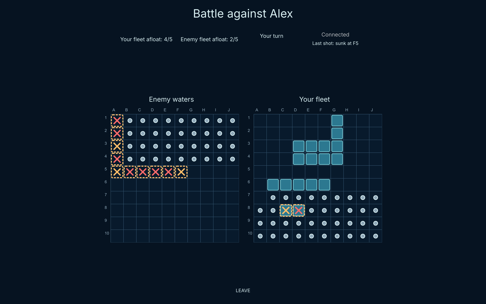
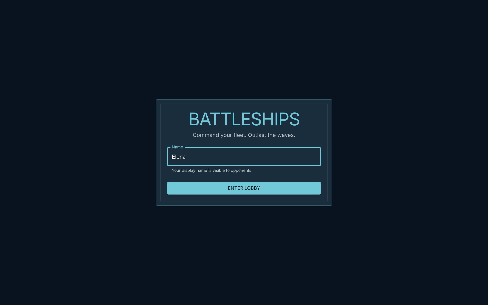
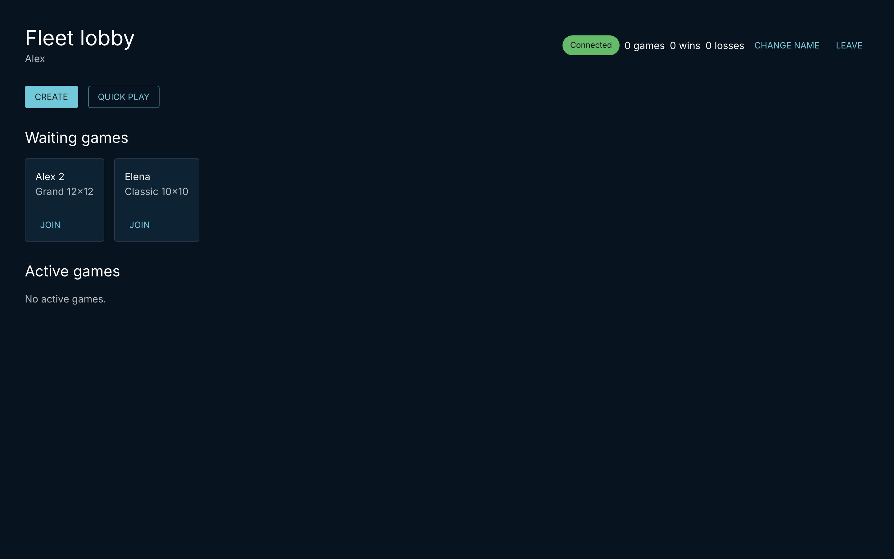
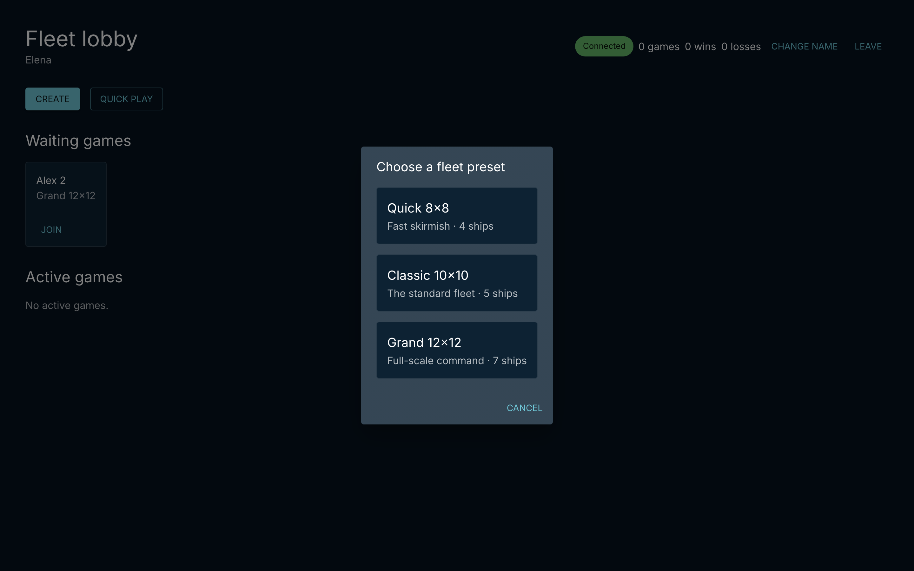
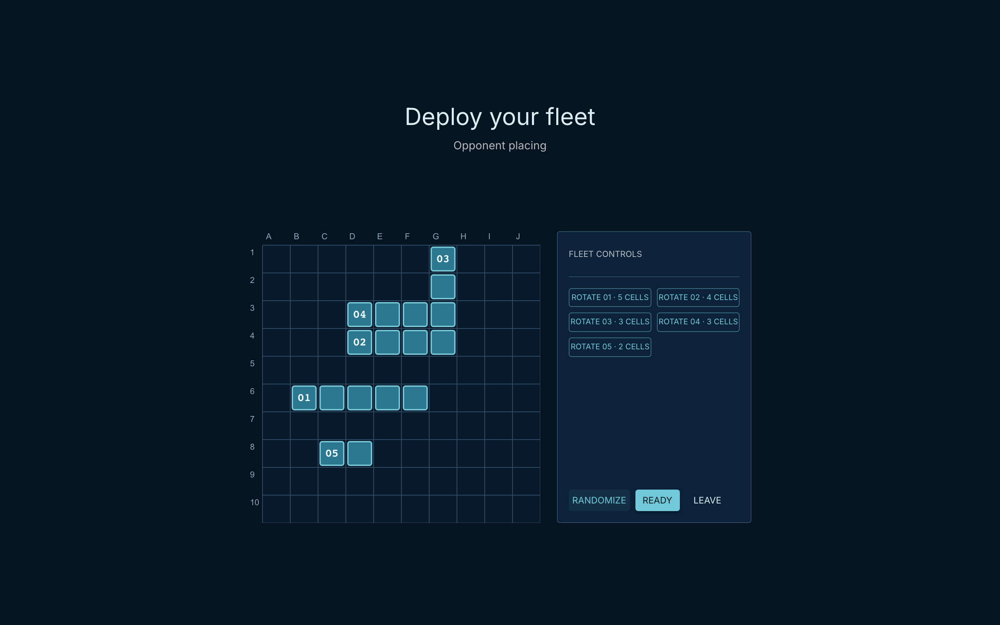
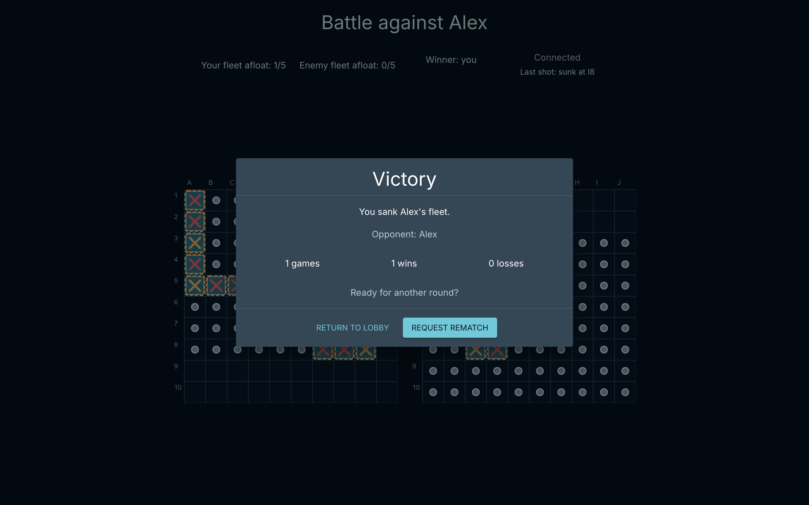
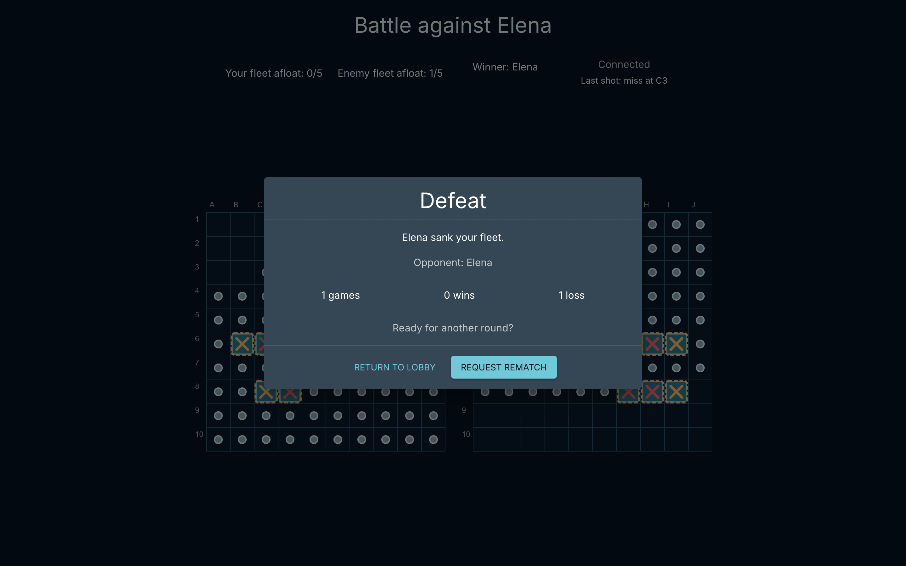

# Battleships

A real-time multiplayer Battleship game for two remote players. Enter a name, create a game or join one from the lobby, place your fleet and play turn by turn. Moves reach the opponent instantly over WebSockets, and many games run at the same time.

**Live demo:** https://battleships-g9yd.onrender.com



## Try it

1. Open the [live demo](https://battleships-g9yd.onrender.com) in two browser windows (or on two computers).
2. Enter a name in each window. No registration or password is needed.
3. In the first window click **Create** and choose a board. In the second window click **Join** on that game, or use **Quick Play**.
4. Place your ships (drag, rotate or **Randomize**), click **Ready** and start firing.

The demo runs on a free plan, so the first page load after a pause can take about a minute. The game is designed for desktop screens (1024 px and wider).

## Features

- **Name-only entry.** Players are identified by name. If the name is taken, the next player gets `Alex 2`, `Alex 3` and so on.
- **Lobby.** Lists games waiting for an opponent and games in progress, with live updates.
- **Create, Join or Quick Play.** Host a game with a chosen board, join any waiting game, or press Quick Play to join a random open game (a new Classic game is created if none is open).
- **Three board presets:**

  | Preset  | Board | Fleet                        |
  | ------- | ----- | ---------------------------- |
  | Quick   | 8×8   | 4 ships: 4, 3, 3, 2          |
  | Classic | 10×10 | 5 ships: 5, 4, 3, 3, 2       |
  | Grand   | 12×12 | 7 ships: 5, 4, 4, 3, 3, 2, 2 |

- **Fleet placement.** Drag ships onto the board, rotate them or place the whole fleet randomly. Placement is validated on the client and on the server.
- **Real-time battle.** Shots, hits, misses and sunk ships appear for both players immediately. A hit gives an extra shot, a miss passes the turn.
- **Fair play.** The server is the source of truth: it validates every shot and never sends the opponent's ship positions until the game is over.
- **Reconnects.** If a player drops, the game pauses and waits up to 5 minutes. Reloading the page returns the player to the same game.
- **Results and rematch.** Victory or defeat screen with the opponent's fleet revealed, then a one-click rematch request.
- **Player statistics.** Games, wins and losses are tracked for each player, shown in the lobby and on the result screen, and survive a page reload.
- **Forfeit.** Leaving a game in progress counts as a loss and the opponent wins.

## Screenshots

| Welcome                                         | Lobby                                                   |
| ----------------------------------------------- | ------------------------------------------------------- |
|  |  |

| Create a game                                              | Fleet placement                                     |
| ---------------------------------------------------------- | --------------------------------------------------- |
|  |  |

| Victory                                        | Defeat                                               |
| ---------------------------------------------- | ---------------------------------------------------- |
|  |  |

## Architecture

The project is an npm workspaces monorepo written in strict TypeScript.

```
apps/
  web/              React client: lobby, fleet placement, battle and result screens
  server/           Express + Socket.IO server: identities, lobby, game sessions, stats
packages/
  contracts/        Zod schemas for every socket command and snapshot, shared by client and server
  game-engine/      Pure game logic: placement rules, shots, turns, random fleets
```

- The client sends typed commands (`lobby.create`, `fleet.ready`, `game.shot`, `rematch.request` and others). The server validates each one with the shared Zod schemas, updates the game state and pushes a new snapshot to every player involved.
- Each player only receives a projection of the game made for them, so hidden information never leaves the server.
- The game engine has no I/O, which keeps the rules easy to test in isolation.
- Game sessions and statistics are kept in server memory, so the app needs no database.
- In production the Express server also serves the built client, so the whole app runs as one service.

## Tech stack

|             |                                                                                                                            |
| ----------- | -------------------------------------------------------------------------------------------------------------------------- |
| **Client**  | React 19, TypeScript, Vite, MUI, Konva (board rendering), dnd kit (drag and drop), Zustand, React Router, Socket.IO client |
| **Server**  | Node.js, TypeScript, Express 5, Socket.IO                                                                                  |
| **Shared**  | Zod schemas, pure TypeScript game engine                                                                                   |
| **Tooling** | Vitest, Testing Library, ESLint, Prettier                                                                                  |

## Getting started

### Requirements

- Node.js 22+

### Install

```bash
npm install
```

### Run in development

```bash
# Server on http://localhost:3000, restarts on changes
npm run dev --workspace @battleships/server

# Client on http://localhost:5173, proxies WebSocket traffic to the server
cd apps/web && npx vite
```

### Production build

```bash
npm run build
NODE_ENV=production node apps/server/dist/index.js
```

The app is then available on http://localhost:3000. Set `PORT` to use another port.

### Checks

```bash
npm test             # 160 Vitest tests for the client, server and game engine
npm run typecheck    # TypeScript project references
npm run lint         # ESLint
npm run format:check # Prettier
```
